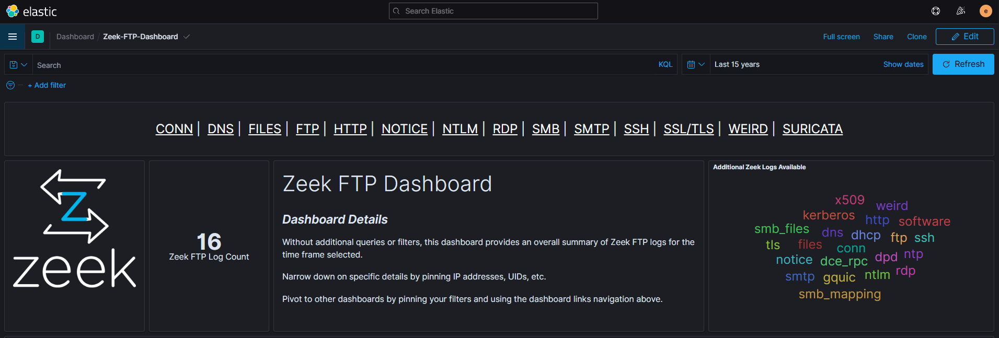
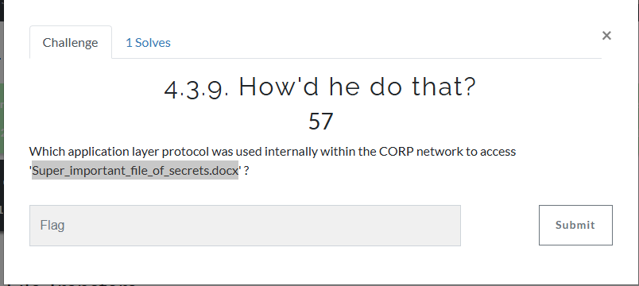
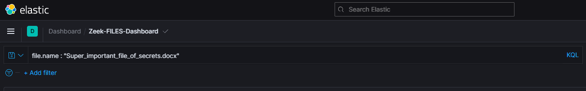
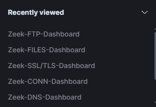
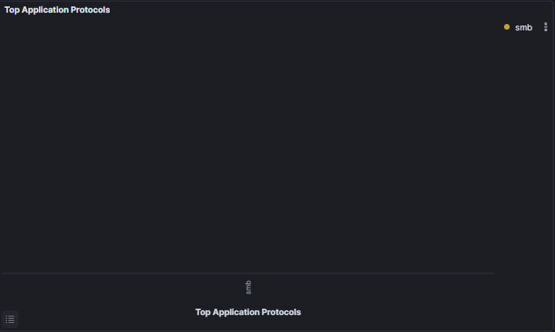

# SMB File Access Investigation

## Overview

Traced internal file access patterns to identify the origin point of a sensitive document before external exfiltration. Demonstrated ability to track lateral movement and file access within enterprise networks using SMB protocol analysis.

## Scenario

File "Super_important_file_of_secrets.docx" was discovered on an external FTP server. Investigation required identifying which internal protocol was used to access this file within the CORP network before exfiltration occurred.

## Tools Used

- **Elastic SIEM** - Log analysis and dashboard visualization
- **Zeek** - Network protocol monitoring and file tracking
- **Query Language** - KQL for targeted file investigation

## Investigation Process

### 1. File Identification
- Searched Zeek-FILES Dashboard for target file
- Query: `file.name : "Super_important_file_of_secrets.docx"`
- Analyzed Top Application Protocols panel

### 2. Protocol Analysis
- Identified SMB (Server Message Block) as the internal access protocol
- Confirmed file was accessed via SMB before FTP exfiltration
- Traced internal file movement within CORP network

### 3. Key Findings
- **Protocol Used:** SMB (port 445)
- **Access Location:** Internal CORP network
- **Significance:** Indicates lateral movement before exfiltration
- **Attack Chain:** Internal SMB access → External FTP transfer

## MITRE ATT&CK Mapping

- **T1021.002** - Remote Services: SMB/Windows Admin Shares
- **T1570** - Lateral Tool Transfer
- **T1083** - File and Directory Discovery

## Skills Demonstrated

- SMB protocol analysis and file tracking
- Elastic SIEM dashboard navigation and filtering
- Multi-stage attack investigation (internal access → external exfiltration)
- Understanding enterprise file-sharing protocols
- KQL query development for file forensics

## Conclusions

Successfully identified SMB as the internal protocol used to access the sensitive file before exfiltration. This investigation demonstrates understanding of lateral movement techniques and the ability to trace file access across multiple attack stages within enterprise environments.

---

**Portfolio:** [github.com/paigealfred](https://github.com/paigealfred)

# SMB File Access Investigation

## Overview

Traced internal file access patterns to identify the origin point of a sensitive document before external exfiltration. Demonstrated ability to track lateral movement and file access within enterprise networks using SMB protocol analysis.

## Scenario

File "Super_important_file_of_secrets.docx" was discovered on an external FTP server. Investigation required identifying which internal protocol was used to access this file within the CORP network before exfiltration occurred.

## Tools Used

- **Elastic SIEM** - Log analysis and dashboard visualization
- **Zeek** - Network protocol monitoring and file tracking
- **Query Language** - KQL for targeted file investigation

## Investigation Process

### 1. Initial Dashboard Access

*Accessed Zeek-FILES Dashboard in Elastic SIEM for file tracking analysis*

### 2. File Search Query

*Executed KQL query: `file.name : "Super_important_file_of_secrets.docx"` to isolate target file*

### 3. Protocol Identification

*Top Application Protocols panel revealed SMB as the internal access protocol*

### 4. Protocol Analysis

*Detailed analysis confirmed SMB (Server Message Block) usage for internal file access*

### 5. Investigation Results

*Validated SMB protocol usage within CORP network before external exfiltration*

## Key Findings

- **Protocol Identified:** SMB (Server Message Block)
- **Port:** 445 (standard SMB port)
- **Access Location:** Internal CORP network (172.16.100.x subnet)
- **File Accessed:** Super_important_file_of_secrets.docx
- **Significance:** Internal file access preceded external FTP exfiltration
- **Attack Pattern:** Lateral movement → File discovery → Exfiltration

## MITRE ATT&CK Mapping

- **T1021.002** - Remote Services: SMB/Windows Admin Shares
- **T1570** - Lateral Tool Transfer  
- **T1083** - File and Directory Discovery
- **T1039** - Data from Network Shared Drive

## Skills Demonstrated

- **Elastic SIEM Navigation** - Dashboard usage and log filtering
- **KQL Query Development** - Targeted file search queries
- **SMB Protocol Analysis** - Understanding enterprise file-sharing protocols
- **File Tracking** - Tracing document access across network segments
- **Multi-Stage Investigation** - Connecting internal access to external exfiltration
- **Attack Chain Reconstruction** - Understanding lateral movement techniques

## Technical Details

**SMB (Server Message Block):**
- Application-layer protocol for file sharing over networks
- Commonly used in Windows environments for shared drives
- Port 445 (TCP)
- Critical protocol for lateral movement detection in enterprise SOCs

**Investigation Methodology:**
1. Searched file activity logs using exact filename
2. Analyzed protocol field to determine access method
3. Correlated with network topology to confirm internal vs external access
4. Validated findings through dashboard visualization

## Conclusions

Successfully identified SMB as the internal protocol used to access sensitive file before exfiltration. This investigation demonstrates:

- Understanding of enterprise file-sharing protocols
- Ability to track file access across network segments  
- Recognition of lateral movement indicators
- Skill in correlating internal reconnaissance with external data theft
- Proficiency with Elastic SIEM and Zeek for file forensics

This analysis shows the complete attack chain: **Internal SMB Access → File Discovery → External FTP Exfiltration**

## Related Investigations

This project connects with [FTP Data Exfiltration Investigation](../ftp-exfiltration-investigation) where the same file was transferred externally via FTP after initial SMB access.

---

**Portfolio:** [github.com/paigealfred](https://github.com/paigealfred)
